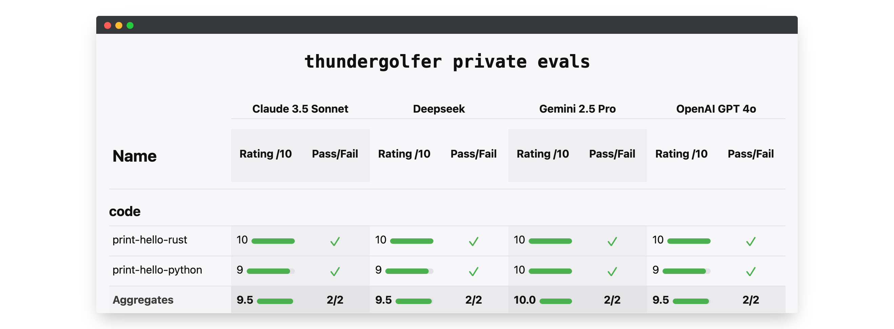
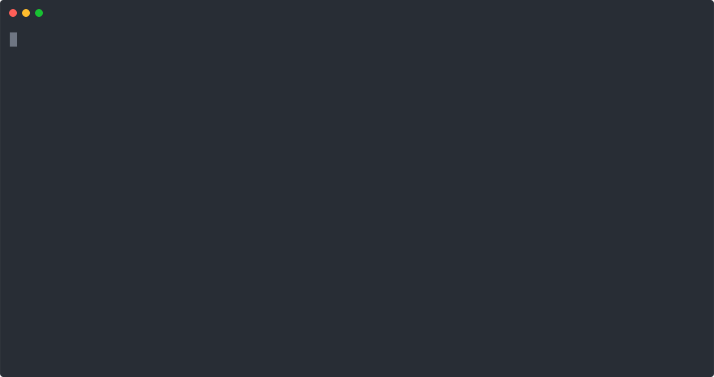
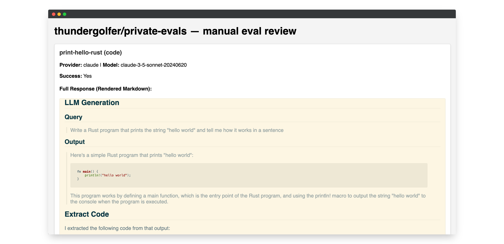

# private evals

> Discussed in **https://thundergolfer.com/blog/private-evals**.

This code uses `uv`, `invoke`, and [`modal`](https://modal.com) run run private LLM evaluations
defined in [`llm_tests/`](./llm_tests/).

<p align="center">
  
</p>


## Usage

You can `uv run inv` run the following subcommands:

- `run-all` (e.g. `uv run inv run-all`)
- `run`
- `generate-report`
- `prompt`

**`run_all`**

  


  Run all LLM tests against one or all providers and generate a report.

_Options:_ 
  - `-p STRING, --provider=STRING`

**`run`** 

  Run a single LLM test against one provider and print the result.
  Test arguments should be the module name of the test inside the `llm_tests` package.

  _e.g._ `print_hello_python.py` → `--test="print_hello_python"`

**`prompt`**

  Run a text prompt against one or all providers and print the result.
  This is just a sanity check command to ensure that the LLM clients are working.

_Options:_
  - `-p STRING, --prompt=STRING`
  - `-r STRING, --provider=STRING`

**`generate-report`**

  Take an existing saved results JSON file and generate from it an HTML report.

## Manual review tool

It's often necessary to maintain manually reviewed private evals.
For these the `review_app.py` tool can be used to mutate an existing
`results.json` file.

```bash
uv run --with flask review_app.py
```

This will open a web interface where you can review and rate each test result:



## Deploy cron job on [Modal](https://modal.com)

I use Modal to run these private evals weekly, storing
the results in a persistent Volume.

First, create a `modal.Secret` with the following:

- `ANTHROPIC_API_KEY`
- `OPENAI_API_KEY`
- `DEEPSEEK_API_KEY`
- `GOOGLE_AISTUDIO_API_KEY`

Then deploy it with `uv run modal deploy.py`.
